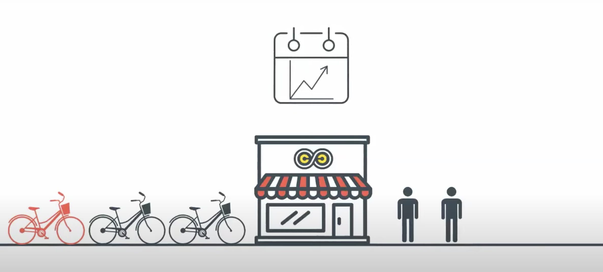

# Bike Sharing Prediction using Neural Network

# Introduction - Business Problem:
As a bike sharing company we need to predict how many bikes we will need in the near future. Few of the reasons are:
  - If we have a higher supply of bikes and lower demand, it will add to our OPEX.
  - If we have a lower supply than demand, then we loose on profits.
  

# Design Overview:
We will build a neural network from __scratch__ and implement __feedforward__ and __backpropogation__ using __stochastic gradient descent__. 
Later we will test out the network's efficacy on unseen data.

# Libraries needed:
- Numpy
- Pandas
- Matplotlib

# Results:

